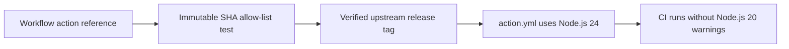

# Track 92 Specification: GitHub Actions Runtime Modernization

## Goal

Remove Node.js 20 deprecation warnings and mutable action references by pinning every use of `actions/checkout`, `actions/upload-artifact`, and `actions/download-artifact` to current Node.js 24-compatible immutable commit SHAs.

## MoSCoW requirements

### Must

- Pin `actions/checkout` v7.0.0 to `9c091bb21b7c1c1d1991bb908d89e4e9dddfe3e0`.
- Pin `actions/upload-artifact` v7.0.1 to `043fb46d1a93c77aae656e7c1c64a875d1fc6a0a`.
- Pin `actions/download-artifact` v8.0.1 to `3e5f45b2cfb9172054b4087a40e8e0b5a5461e7c`.
- Cover every workflow occurrence and reject mutable tags or unapproved SHAs in tests.
- Preserve existing workflow permissions, inputs, artifact names, and behavior.

### Should

- Record the upstream tag-to-commit and `runs.using: node24` verification evidence.
- Keep the policy test simple to update when a later reviewed action release is adopted.

### Could

- Extend the allow-list test to other first-party actions in a later supply-chain track.

### Won't

- Upgrade unrelated actions or change workflow semantics in this track.
- Modify dependency lockfiles.

## Design

## Acceptance

- Repository-wide policy tests enumerate all three action families and accept only the approved 40-character SHAs.
- Focused workflow tests and Ruff pass.
- `pixi.lock` remains untouched.
