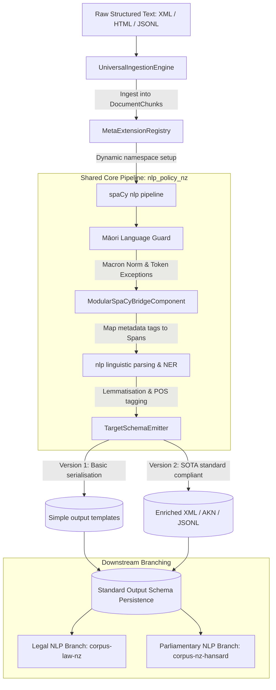

# System Design: nlp-policy-nz

This document details the system design, pipeline architecture, and schema definitions for the `nlp-policy-nz` unified core.

---

## 1. System Architecture Diagram

## 2. Versioning Strategy & Evolution Path

To track structural improvements and preserve development stages, the framework implements explicit version files in `src/nlp_policy_nz/`:

- **[universal_framework_v1.py](./../src/nlp_policy_nz/universal_framework_v1.py)**: The baseline abstract model. Implements formatting interfaces (BeautifulSoup parsing, dynamic namespace registry) and simple XML block wrapping outputs.
- **[universal_framework_v2.py](./../src/nlp_policy_nz/universal_framework_v2.py)**: The maximal-standards release. Introduces sentence-level XML boundaries (`<s>`), speaker/utterance contexts (`<u>`), full XML headers (`<meta>`), and syntax dependency mapping (`deprel`, `head_index`) in ParlaCAP-JSONL records.

---

## 3. Shared Core Pipeline Design

### Phase 1: Ingestion & Preprocessing
The ingestion layer implements an abstract class `UniversalIngestionEngine` which resolves the source format:
- `XMLIngestionEngine`: Parses nested XML documents via BeautifulSoup/lxml.
- `HTMLIngestionEngine`: Parses web article segments.
- `JSONLIngestionEngine`: Streams flat JSON-lines documents.

### Phase 2: Dynamic Registry Configuration
The `MetaExtensionRegistry` sanitizes regional and target parameters (e.g. `COUNTRY` and `TARGET_SCHEMA_STANDARD`) and registers namespace-isolated properties in spaCy (e.g. `doc._.new_zealand_parlamint_tei_ana_country`) to avoid variable conflicts during execution.

### Phase 3: Modular spaCy Bridge & Parser
- **Modular Bridge (`ModularSpaCyBridgeComponent`)**: Custom pipeline component that maps document bounds to token-level Spans, attaching structural category and ID keys.
- **Māori Language Guard**: Injects token exception rules and unicode normalization.

### Phase 4: Target Schema Emitter (Version 2 Standards)
- **TEI XML Serialization**: Packages lemma, POS, and detailed MSD tags inside `<w>` token containers, nested within sentence `<s>` and utterance `<u>` blocks.
- **Akoma-Ntoso**: Generates valid AKN XML legal hierarchical blocks incorporating metadata headers (`<identification>`, `<publication>`).
- **JSON-Lines**: Outputs flat, streamable records containing joint syntactic dependency indexes.
