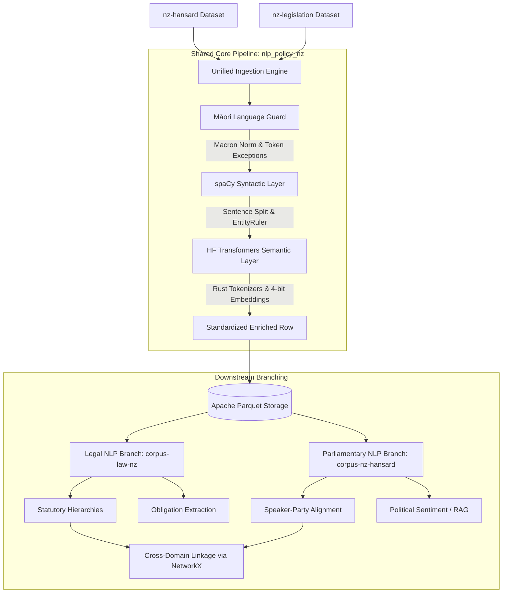

# System Design: nlp-policy-nz

This document details the system design, pipeline architecture, and schema definitions for the `nlp-policy-nz` unified core.

---

## 1. System Architecture Diagram

## 2. Shared Core Pipeline Design

### Phase 1: Ingestion & Preprocessing
The ingestion layer loads text inputs dynamically from Hugging Face datasets or local raw streams. It uses `nlp.pipe` streaming in batches to process text in parallel chunks, ensuring a low memory footprint.

### Phase 2: Māori Language Guard (SOTA)
- **Token Exception Rules**: Injected into the spaCy tokenizer during pipeline initialization. This ensures terms like *tikanga*, *taonga*, and *kāwanatanga* are recognized as atomic tokens.
- **Macron Normalizer**: Converts unicode characters to Unicode Normalization Form C (NFC) to guarantee consistency across different documents that may use inconsistent macron conventions.

### Phase 3: Syntactic Layer (spaCy)
- **Sentenceizer**: Segments long legislative clauses and speaker debates.
- **EntityRuler**: Matches statutory patterns (e.g. `[Crimes Act 1961]`) and relative references (e.g. `[section 4]`) using regex pattern dictionaries.

### Phase 4: Semantic Layer (Hugging Face)
- **Rust Fast Tokenizers**: Invoked using `use_fast=True` via Hugging Face tokenizers.
- **Quantized Legal Model**: Processes text chunks through a 4-bit quantized embedding model (`nlpaueb/legal-bert-base-uncased` or `Equall/SaulLM-7B`) utilizing `bitsandbytes` locally.

---

## 3. Standardized Output Schema (Flat-Table Layout)

The pipeline outputs an Apache Parquet dataset structured under the following schema:

| Column Name | Data Type | Description / Purpose |
| :--- | :--- | :--- |
| `doc_id` | `String` | Unique structural ID (e.g., `NZ-ACT-1961-043-SEC-4` or `NZ-HANS-2023-05-12-SP-04`). |
| `corpus_source` | `String` | Explicit category tag (`legislation` or `hansard`). |
| `raw_text` | `String` | The raw text snippet (a parliamentary speech turn or a legislative section). |
| `cleaned_tokens` | `List[String]` | Lowercased, clean tokens generated at C/Rust speed, excluding punctuation. |
| `nz_act_citations` | `List[String]` | Array of NZ Act names identified by the spaCy `EntityRuler`. |
| `te_reo_terms` | `List[String]` | Array of Māori legal/cultural words detected and protected by the Māori Language Guard. |
| `embeddings` | `List[Float]` | (Optional) Dense vector representation generated by the Hugging Face transformer model. |
