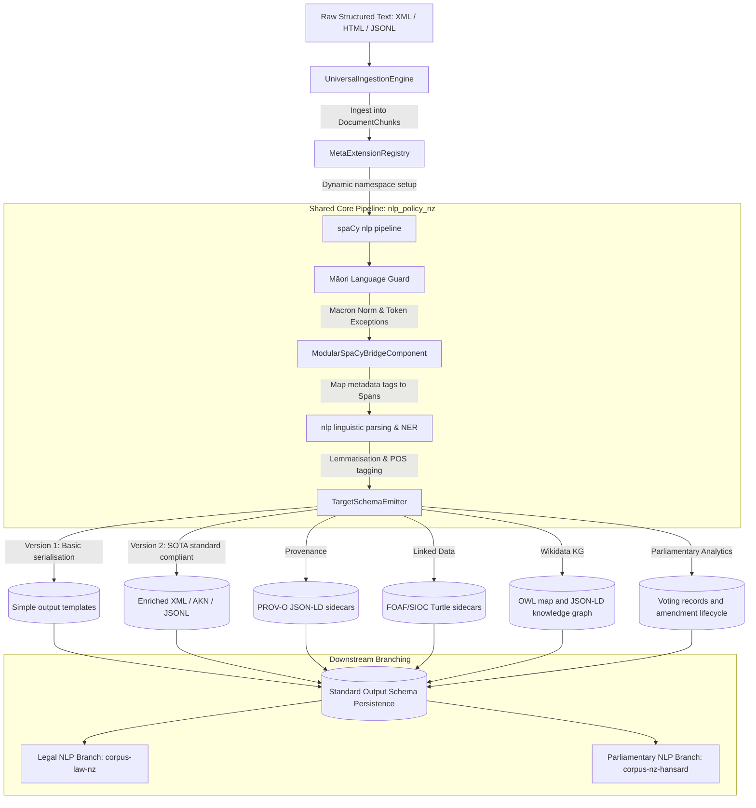

# System Design: nlp-policy-nz

This document details the system design, pipeline architecture, and schema definitions for the `nlp-policy-nz` unified core.

---

## 1. System Architecture Diagram

## 2. Versioning Strategy & Evolution Path

To track structural improvements and preserve development stages, the framework implements explicit version files in `src/nlp_policy_nz/`:

- **[universal_framework_v1.py](./../src/nlp_policy_nz/universal_framework_v1.py)**: The baseline abstract model. Implements formatting interfaces (BeautifulSoup parsing, dynamic namespace registry) and simple XML block wrapping outputs.
- **[universal_framework_v2.py](./../src/nlp_policy_nz/universal_framework_v2.py)**: The maximal-standards release. Introduces sentence-level XML boundaries (`<s>`), speaker/utterance contexts (`<u>`), full XML headers (`<meta>`), and syntax dependency mapping (`deprel`, `head_index`) in ParlaCAP-JSONL records.
- **[universal_framework_v3.py](./../src/nlp_policy_nz/universal_framework_v3.py)**: Adds corpus-level span grouping, legal effect hooks, and displaCy-oriented output while preserving v2 behavior.
- **[universal_framework_v4.py](./../src/nlp_policy_nz/universal_framework_v4.py)**: Adds Akoma Ntoso v3 document emission as an opt-in layer with full FRBR hierarchy and XSD-backed validation.

---

## 3. Shared Core Pipeline Design

### Phase 1: Ingestion & Preprocessing
The ingestion layer implements an abstract class `UniversalIngestionEngine` which resolves the source format:
- `XMLIngestionEngine`: Parses nested XML documents via BeautifulSoup/lxml.
- `HTMLIngestionEngine`: Parses web article segments.
- `JSONLIngestionEngine`: Streams flat JSON-lines documents.

### Phase 2: Dynamic Registry Configuration
The `MetaExtensionRegistry` sanitizes regional and target parameters (e.g. `COUNTRY` and `TARGET_SCHEMA_STANDARD`) and registers namespace-isolated properties in spaCy (e.g. `doc._.new_zealand_parlamint_tei_ana_country`) to avoid variable conflicts during execution.

### Phase 3: Modular spaCy Bridge & Parser
- **Modular Bridge (`ModularSpaCyBridgeComponent`)**: Custom pipeline component that maps document bounds to token-level Spans, attaching structural category and ID keys.
- **Māori Language Guard**: Injects token exception rules and unicode normalization.

### Phase 4: Target Schema Emitter (Version 2 Standards)
- **TEI XML Serialization**: Packages lemma, POS, and detailed MSD tags inside `<w>` token containers, nested within sentence `<s>` and utterance `<u>` blocks.
- **Akoma-Ntoso**: Generates AKN XML legal hierarchical blocks incorporating metadata headers (`<identification>`, `<publication>`); v4 adds AKN v3 FRBR Work/Expression/Manifestation/Item metadata plus XSD-backed validation in `schema/akn_v3.py`.
- **JSON-Lines**: Outputs flat, streamable records containing joint syntactic dependency indexes.

### Phase 5: PROV-O provenance
- **Recorder**: `provenance/recorder.py` captures pipeline name, package version, commit SHA, model versions, parameters, timestamps, input paths, output path, and record counts.
- **Serializer**: `provenance/serializer.py` emits PROV-O JSON-LD bundles with Entity, Activity, and SoftwareAgent nodes.
- **Sidecars and archives**: Pipeline outputs write adjacent `.prov.json` sidecars; release archives and Zenodo deposit payloads include provenance metadata.

### Phase 6: Parliamentary linked data
- **FOAF profiles**: `linked_data/foaf.py` converts MP knowledge-base rows into FOAF Person resources with party Organization, role, electorate, and optional Wikidata links.
- **SIOC discourse graph**: `linked_data/sioc.py` maps Hansard records to SIOC Site, Forum, Thread, and Post resources for parliamentary debate traversal.
- **RDF operations**: `linked_data/rdf.py` writes Turtle sidecars and runs local SPARQL SELECT queries; the CLI exposes this through `export-rdf` and `sparql`.

### Phase 7: Wikidata knowledge graph integration
- **Ontology map**: `data/ontologies/nz_wikidata_map.ttl` maps New Zealand Acts, MPs, parties, electorates, and courts to Wikidata classes and properties.
- **QID resolution and enrichment**: `kb/wikidata_kg.py` resolves entity names with cached SPARQL lookups and enriches records with inception dates and party membership periods.
- **Knowledge graph export**: the `knowledge-graph` CLI command writes schema.org-compatible JSON-LD from Wikidata-annotated entities.
- **Federated query examples**: `data/ontologies/wikidata_federated_example.rq` documents the local KG to Wikidata `SERVICE` join pattern.

### Phase 8: Parliamentary voting and amendments
- **Voting parser**: `parliament/voting.py` extracts division motions, MP-level votes, party tallies, counts, and outcomes from Hansard division text.
- **Amendment analytics**: `parliament/amendments.py` parses amendment proposer, type, target clause, SOP number, structural bill diffs, and amendment lifecycle graphs.
- **Pipeline enrichment**: `PipelineRecord` includes optional `voting_record` and `amendments` fields populated during Hansard and legislation processing.
- **Query commands**: the CLI exposes `voting-summary` and `amendment-history` for direct local analysis of text files.
