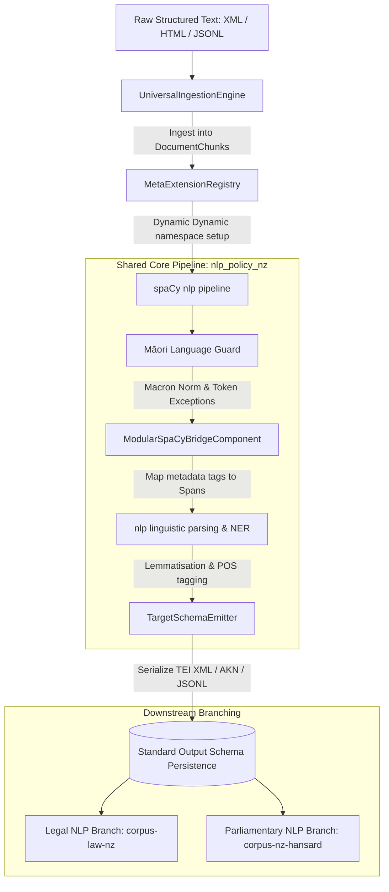

# System Design: nlp-policy-nz

This document details the system design, pipeline architecture, and schema definitions for the `nlp-policy-nz` unified core.

---

## 1. System Architecture Diagram

## 2. Shared Core Pipeline Design

### Phase 1: Ingestion & Preprocessing
The ingestion layer implements an abstract class `UniversalIngestionEngine` which resolves the source format:
- `XMLIngestionEngine`: Parses nested XML documents via BeautifulSoup/lxml.
- `HTMLIngestionEngine`: Parses web article segments.
- `JSONLIngestionEngine`: Streams flat JSON-lines documents.

### Phase 2: Dynamic Registry Configuration
The `MetaExtensionRegistry` sanitizes regional and target parameters (e.g. `COUNTRY` and `TARGET_SCHEMA_STANDARD`) and registers namespace-isolated properties in spaCy (e.g. `doc._.new_zealand_parlamint_tei_ana_country`) to avoid variable conflicts during execution.

### Phase 3: Modular spaCy Bridge & Parser
- **Modular Bridge (`ModularSpaCyBridgeComponent`)**: Custom pipeline component that maps document bounds to token-level Spans, attaching structural category and ID keys.
- **Māori Language Guard**: Injects token exception rules and unicode normalization.

### Phase 4: Target Schema Emitter
- **TEI XML Serialization**: Packages lemma and POS attributes inside `<w>` token containers.
- **Akoma-Ntoso**: Generates valid AKN XML legal hierarchical blocks.
- **JSON-Lines**: Outputs flat, streamable records optimized for Transformer training.
