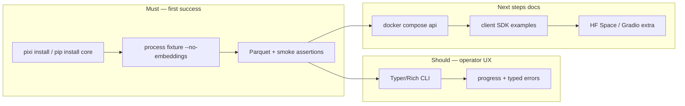

# Track 100: Adopter DX, slim install and honest quickstart

Parent programme: [#196](https://github.com/edithatogo/nlp-policy-nz/issues/196)  
Track issue: [#197](https://github.com/edithatogo/nlp-policy-nz/issues/197)

Subissues:

- [#204](https://github.com/edithatogo/nlp-policy-nz/issues/204) Unified fixture quickstart (no Docker required)
- [#205](https://github.com/edithatogo/nlp-policy-nz/issues/205) Slim default install extras split
- [#206](https://github.com/edithatogo/nlp-policy-nz/issues/206) Honest Compose and QUICKSTART alignment

## Overview

Make first-time adoption reliable for NZ researchers and engineers: one honest path from install → process a fixture → optional Docker/API/Spaces. Reduce default install weight so `pip install nlp-policy-nz` matches “shared NLP core”, not a full ML + Gradio stack.

## Design

## MoSCoW requirements

### Must

| ID | Requirement |
|----|-------------|
| M-ADX-1 | Single documented fixture CLI path that does not require Docker, Qdrant, or embeddings |
| M-ADX-2 | README, QUICKSTART, and docs-site quickstart agree on the same first path |
| M-ADX-3 | Default install excludes Gradio / Spaces / unnecessary heavy ML where feasible; extras documented |
| M-ADX-4 | Compose services that are volume stubs (e.g. lancedb/model-cache) are labelled as stubs in docs |

### Should

| ID | Requirement |
|----|-------------|
| S-ADX-1 | Typer/Rich CLI UX for high-traffic operator commands |
| S-ADX-2 | Extras matrix table: `core`, `api`, `space`, `ml`, `orchestration`, `client` |

### Could

| ID | Requirement |
|----|-------------|
| C-ADX-1 | `nlp-policy-nz doctor` post-install environment probe |

### Won't

| ID | Requirement | Rationale |
|----|-------------|-----------|
| W-ADX-1 | Hosted SaaS onboarding portal | Out of product scope |
| W-ADX-2 | Require GPU for first-run success | Blocks laptop adopters |

## Acceptance criteria

- [ ] Fixture quickstart runs under CI or documented pixi task without network model download
- [ ] Install docs list extras; default path does not pull Gradio unless `[space]`/`[api]` chosen
- [ ] QUICKSTART no longer implies stub Compose services are full LanceDB servers
- [ ] Issues #197/#204–#206 linked from registry

## Out of scope

- Rights clearance, FOI promotion, or multi-jurisdiction profile packaging (Tracks 102–103)
- Changing canonical spaCy / LanceDB / PipelineRecord engines
