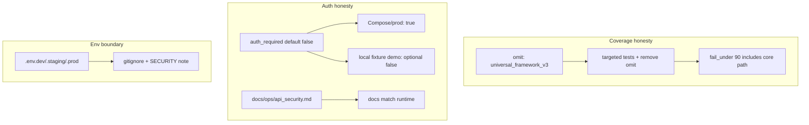

# Track 101: Core framework coverage and auth/env honesty

Parent programme: [#196](https://github.com/edithatogo/nlp-policy-nz/issues/196)  
Track issue: [#198](https://github.com/edithatogo/nlp-policy-nz/issues/198)

Subissues:

- [#207](https://github.com/edithatogo/nlp-policy-nz/issues/207) Include core `universal_framework` in coverage gate
- [#208](https://github.com/edithatogo/nlp-policy-nz/issues/208) Align API auth default with ops docs and Compose/prod
- [#209](https://github.com/edithatogo/nlp-policy-nz/issues/209) Ignore env profile files (`.env.dev/.staging/.prod`)

## Overview

Close credibility gaps in quality and security posture: the advertised ~90% coverage gate currently omits core ingestion/AKN emitter modules, and API auth defaults to off while ops docs imply keys are required.

## Design

## MoSCoW requirements

### Must

| ID | Requirement |
|----|-------------|
| M-QH-1 | Core `universal_framework_v3` (and emitter paths exercised by AKN fixtures) included in coverage gate or explicitly residual-justified with owner + expiry |
| M-QH-2 | Compose and production profiles set `NLP_POLICY_NZ_REQUIRE_API_AUTH=true` |
| M-QH-3 | Ops security docs describe actual default vs profile overrides accurately |
| M-QH-4 | `.env.dev`, `.env.staging`, `.env.prod` ignored by git |

### Should

| ID | Requirement |
|----|-------------|
| S-QH-1 | Scheduled (non-PR) mutation testing for guard/parser modules |
| S-QH-2 | Refresh maturity checklist: pydantic already used in FOI schemas |

### Could

| ID | Requirement |
|----|-------------|
| C-QH-1 | `pydantic-settings` for typed environment loading |

### Won't

| ID | Requirement | Rationale |
|----|-------------|-----------|
| W-QH-1 | Lower `fail_under` to make omit removal easy | Hides real gaps |
| W-QH-2 | Force auth on every local unit test | Breaks fixture DX |

## Acceptance criteria

- [ ] Coverage config/docs updated; CI proves core path measured
- [ ] Compose/prod auth required; docs aligned
- [ ] Env profile files ignored
- [ ] Issues #198/#207–#209 linked from registry

## Out of scope

- Full Track 46 production hardening remaining work
- FOI empirical promotion evidence (Track 102 / #132/#133)
