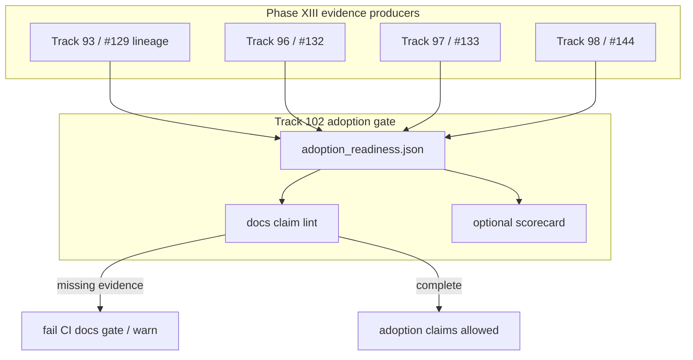

# Track 102: NZ evidence adoption gate

Parent programme: [#196](https://github.com/edithatogo/nlp-policy-nz/issues/196)  
Track issue: [#199](https://github.com/edithatogo/nlp-policy-nz/issues/199)

Subissues:

- [#210](https://github.com/edithatogo/nlp-policy-nz/issues/210) Adoption readiness manifest linking #132/#133/#144
- [#211](https://github.com/edithatogo/nlp-policy-nz/issues/211) Docs claim lint against missing held-out evidence

Coordinates (does not replace):

- [#132](https://github.com/edithatogo/nlp-policy-nz/issues/132) Historical Parliament held-out evaluation
- [#133](https://github.com/edithatogo/nlp-policy-nz/issues/133) Archive transitive-rights and assurance closeout
- [#144](https://github.com/edithatogo/nlp-policy-nz/issues/144) Incremental jurisdiction extraction
- [#129](https://github.com/edithatogo/nlp-policy-nz/issues/129) FOI-O empirical promotion evidence (closed lineage)

## Overview

NZ adoption depends on trustworthy held-out and rights evidence already tracked in Phase XIII. This track adds a **machine-checkable adoption readiness gate** so README/docs cannot silently claim empirical quality while blockers remain open.

## Design

## MoSCoW requirements

### Must

| ID | Requirement |
|----|-------------|
| M-EV-1 | Versioned `adoption_readiness` manifest listing held-out/rights/promotion blockers with issue links |
| M-EV-2 | Manifest distinguishes `contract_only` vs `empirically_supported` claims |
| M-EV-3 | No promotion, rights clearance, or publication performed by this track |

### Should

| ID | Requirement |
|----|-------------|
| S-EV-1 | Docs/CI lint that flags over-claiming language when readiness incomplete |
| S-EV-2 | Licensed fixture-only smoke corpus for demos (explicitly non-held-out) |

### Could

| ID | Requirement |
|----|-------------|
| C-EV-1 | Public redacted readiness badge in README |

### Won't

| ID | Requirement | Rationale |
|----|-------------|-----------|
| W-EV-1 | Replace Tracks 93–97 implementation | Coordination only |
| W-EV-2 | Publish restricted archive text | Rights tracks own that |

## Acceptance criteria

- [ ] Readiness manifest committed and validated by tests
- [ ] Docs gate documented; over-claim paths fail or warn as specified
- [ ] Cross-links to #132/#133/#144/#129 and Tracks 93–98 present
- [ ] Issues #199/#210–#211 linked from registry

## Out of scope

- Collecting the held-out annotations themselves
- Jurisdiction profile packaging (Track 103)
