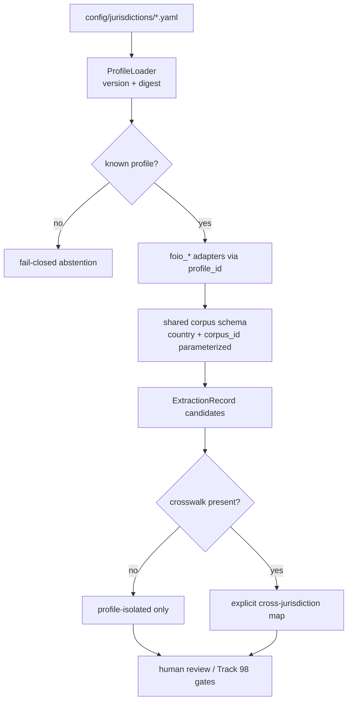

# Track 103: Config-driven jurisdiction profiles and schema generalization

Parent programme: [#196](https://github.com/edithatogo/nlp-policy-nz/issues/196)  
Track issue: [#200](https://github.com/edithatogo/nlp-policy-nz/issues/200)

Subissues:

- [#212](https://github.com/edithatogo/nlp-policy-nz/issues/212) Profile schema + loader (YAML/JSON)
- [#213](https://github.com/edithatogo/nlp-policy-nz/issues/213) Parameterize shared corpus schema country/corpus_id
- [#214](https://github.com/edithatogo/nlp-policy-nz/issues/214) NZ + AU Commonwealth/NSW config-backed profiles
- [#215](https://github.com/edithatogo/nlp-policy-nz/issues/215) Onboarding cookbook and ontology `--profile` export

Extends Track 98 / [#144](https://github.com/edithatogo/nlp-policy-nz/issues/144) and concept-pack [#143](https://github.com/edithatogo/nlp-policy-nz/issues/143). Closed AU adapter lineage: [#101](https://github.com/edithatogo/nlp-policy-nz/issues/101).

## Overview

Enable adapting the pipeline to other countries without forking NZ modules: versioned jurisdiction profiles drive routing, markers, ontology pins, and corpus_id patterns. Keep fail-closed behaviour and explicit crosswalks for any cross-jurisdiction mapping.

## Design

## MoSCoW requirements

### Must

| ID | Requirement |
|----|-------------|
| M-JP-1 | Versioned YAML/JSON jurisdiction profile schema + loader with digests |
| M-JP-2 | Unknown profile_id fails closed (no silent fallback to NZ) |
| M-JP-3 | Parameterize `schemas/shared_nz_corpus_core.schema.json` (`country` / `corpus_id`) — NZ remains default profile |
| M-JP-4 | Ship NZ + AU Commonwealth/NSW profiles backing existing adapters |
| M-JP-5 | Outputs remain candidate-only; no legal promotion from this track |

### Should

| ID | Requirement |
|----|-------------|
| S-JP-1 | `export-ontologies --profile` (generalize NZ-named export) |
| S-JP-2 | Jurisdiction onboarding cookbook + `examples/` profile fixture |
| S-JP-3 | Promote `nlp_policy_nz.extraction` as stable adapter API in docs |

### Could

| ID | Requirement |
|----|-------------|
| C-JP-1 | UK/EU/Alaveteli profile stubs marked `unsupported` with blockers |
| C-JP-2 | Neutral package naming RFC (`nlp-policy-core` + profiles) — design only |

### Won't

| ID | Requirement | Rationale |
|----|-------------|-----------|
| W-JP-1 | Implicit equivalence across jurisdictions | Requires #144 crosswalks |
| W-JP-2 | Auto-promote AU/UK profiles | Evidence gates elsewhere |

## Acceptance criteria

- [ ] Profile schema validated in CI; NZ+AU profiles load
- [ ] Shared schema no longer `const: NZ` only
- [ ] Cookbook documents pin → route → fixture eval → never promote without oracle
- [ ] Issues #200/#212–#215 linked; #144/#143 cross-referenced

## Out of scope

- Completing all Track 98 jurisdiction adapters
- Rights clearance / held-out annotation collection
