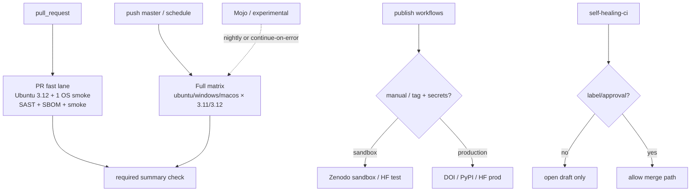

# Track 104: CI tiering and publish-gate honesty

Parent programme: [#196](https://github.com/edithatogo/nlp-policy-nz/issues/196)  
Track issue: [#201](https://github.com/edithatogo/nlp-policy-nz/issues/201)

Subissues:

- [#216](https://github.com/edithatogo/nlp-policy-nz/issues/216) PR fast lane vs nightly full OS matrix
- [#217](https://github.com/edithatogo/nlp-policy-nz/issues/217) Publish sandbox vs production gate documentation
- [#218](https://github.com/edithatogo/nlp-policy-nz/issues/218) Self-heal and experimental job policy

## Overview

Keep strong security/quality gates without paying a full OS×Python matrix on every PR. Document publish secrets honestly so adopters do not infer hosted synchronisation from local CI green.

## Design

## MoSCoW requirements

### Must

| ID | Requirement |
|----|-------------|
| M-CI-1 | PR critical path: Ubuntu 3.12 + one secondary OS smoke; SAST/SBOM retained on Ubuntu 3.12 |
| M-CI-2 | Full OS×Python matrix on `master` and/or nightly schedule |
| M-CI-3 | Publish docs distinguish sandbox vs production and list required secrets |
| M-CI-4 | No claim of hosted publication from local evidence alone |

### Should

| ID | Requirement |
|----|-------------|
| S-CI-1 | Self-healing CI requires label or maintainer approval before merge |
| S-CI-2 | Mojo/experimental jobs off PR critical path |
| S-CI-3 | Clarify Dependabot vs Renovate ownership to reduce duplicate PRs |

### Could

| ID | Requirement |
|----|-------------|
| C-CI-1 | Single required “CI summary” status check aggregating fast-lane jobs |

### Won't

| ID | Requirement | Rationale |
|----|-------------|-----------|
| W-CI-1 | Remove Bandit/Semgrep/pip-audit/SBOM | Security posture stays |
| W-CI-2 | Auto-publish production without human gate | Solo-dev gate still explicit |

## Acceptance criteria

- [ ] Workflow YAML reflects PR vs nightly tiers
- [ ] Docs/runbook list publish gates and secrets
- [ ] Self-heal policy documented and enforced where feasible
- [ ] Issues #201/#216–#218 linked from registry

## Out of scope

- Rewriting all publish adapters
- Changing release versioning scheme
