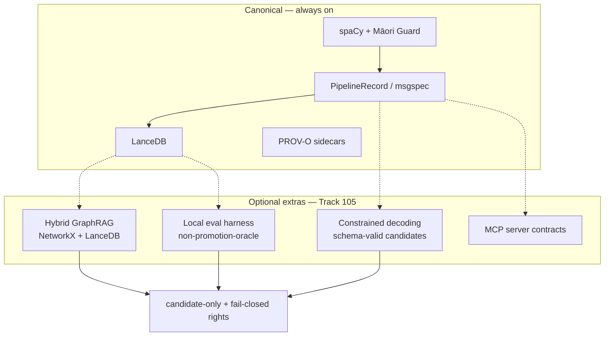

# Track 105: Bleeding-edge SOTA spike (optional extras only)

Parent programme: [#196](https://github.com/edithatogo/nlp-policy-nz/issues/196)  
Track issue: [#202](https://github.com/edithatogo/nlp-policy-nz/issues/202)

Subissues:

- [#219](https://github.com/edithatogo/nlp-policy-nz/issues/219) Decision record for bleeding-edge optional extras
- [#220](https://github.com/edithatogo/nlp-policy-nz/issues/220) Constrained structured decoding spike for extraction
- [#221](https://github.com/edithatogo/nlp-policy-nz/issues/221) Hybrid GraphRAG / legislation graph retrieval spike
- [#222](https://github.com/edithatogo/nlp-policy-nz/issues/222) MCP contract polish and local eval harness spike

Boundary peers: Track 99 / [#189](https://github.com/edithatogo/nlp-policy-nz/issues/189)–[#194](https://github.com/edithatogo/nlp-policy-nz/issues/194).

## Overview

Advance the bleeding edge **without** compromising NZ sovereign/local-first constraints. Evaluate optional extras that make the library attractive to advanced adopters (agents, structured extraction, hybrid retrieval) while keeping spaCy, LanceDB, and `PipelineRecord` canonical.

## Additional recommendations in scope

Beyond the adoption review, this track explicitly evaluates:

1. **Constrained / grammar-guided decoding** (Outlines, XGrammar, Guidance-class) for schema-valid legal extraction candidates.
2. **Hybrid GraphRAG** over citation/NetworkX graphs + LanceDB dense retrieval for legislation navigation.
3. **MCP surface polish** so agent tooling can call process/search/export contracts safely.
4. **Local eval harness** (Inspect AI / DeepEval-class) that is **non-authoritative** for FOI/promotion (same ban as FaithfulnessEvaluator in Track 99).
5. **Could:** Docling/layout adapter comparison; C2PA/content-credentials sidecars for published artifacts.

## Design

## MoSCoW requirements

### Must

| ID | Requirement |
|----|-------------|
| M-BE-1 | Decision record: allowed/banned uses; optional extras only; no default import of heavy SOTA stacks |
| M-BE-2 | Offline fixture demos for any spike that lands in-tree |
| M-BE-3 | No generative cloud defaults on restricted / Māori / sovereign paths |
| M-BE-4 | Eval harness scores never authorize FOI promotion or OIA evidence |

### Should

| ID | Requirement |
|----|-------------|
| S-BE-1 | Constrained decoding spike producing schema-valid `ExtractionRecord` candidates |
| S-BE-2 | Hybrid GraphRAG recipe over fixtures (graph + vector) |
| S-BE-3 | MCP contract/conformance tests for process/search/export |
| S-BE-4 | Document comparison vs Track 99 Haystack shell (complementary, not replacement) |

### Could

| ID | Requirement |
|----|-------------|
| C-BE-1 | Docling / layout-aware adapter compare vs Unstructured (Track 61 lineage) |
| C-BE-2 | C2PA / content-credentials sidecar experiment on publish artifacts |
| C-BE-3 | ONNX/ORT or Candle-class local inference probe for embeddings |

### Won't

| ID | Requirement | Rationale |
|----|-------------|-----------|
| W-BE-1 | Required runtime deps for SOTA stacks | Conflicts with slim install (Track 100) |
| W-BE-2 | Replace LanceDB/spaCy/PipelineRecord | Canonical engines fixed |
| W-BE-3 | Use LLM-as-judge as promotion oracle | Same as W-GOV-4 / Track 99 |

## Acceptance criteria

- [ ] Decision record committed; maturity checklist updated for optional SOTA categories
- [ ] At least two Should spikes have fixture evidence notes (or evidenced blockers)
- [ ] Default import path remains free of new heavy deps
- [ ] Issues #202/#219–#222 linked; #189 boundary respected

## Out of scope

- Productionizing every spike
- Completing Track 98 jurisdictions
- Changing CI into a GPU-required default
