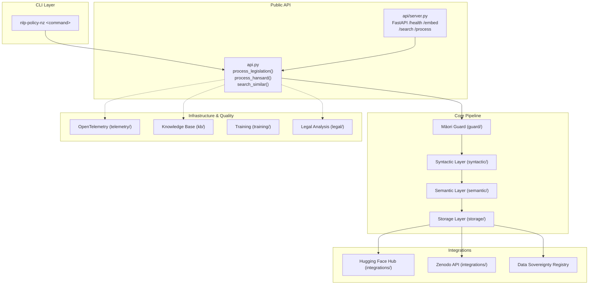
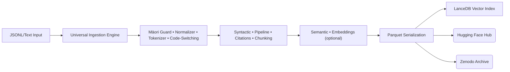
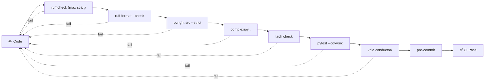
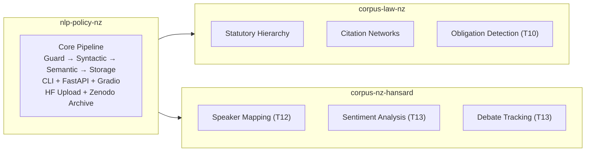

# System Design: nlp-policy-nz

> Architecture diagrams use [Mermaid](https://mermaid.js.org/) — rendered automatically by GitHub.

---

## 1. High-Level Architecture



---

## 2. Module Dependency Graph

```mermaid
flowchart LR
    subgraph Guard["guard/"]
        NORM["normalizer.py"]
        TOK["tokenizer_exceptions.py"]
        LID["language_id.py"]
    end
    subgraph Syntactic["syntactic/"]
        PIPE["pipeline.py"]
        CIT["citations.py"]
        CHUNK["chunking.py"]
    end
    subgraph Semantic["semantic/"]
        ML["model_loader.py"]
        EMB["embeddings.py"]
        FT["finetune.py"]
    end
    subgraph Storage["storage/"]
        SER["serialization.py"]
        VEC["vectordb.py"]
    end
    subgraph CLI_MOD["cli/"]
        MAIN["main.py"]
        GRAPH["graph.py"]
    end
    NORM --> PIPE; TOK --> PIPE; LID --> PIPE
    PIPE --> CIT; PIPE --> CHUNK
    ML --> EMB; EMB --> SER; CHUNK --> SER
    SER --> VEC; CIT --> GRAPH
    MAIN --> PIPE; MAIN --> CIT; MAIN --> GRAPH

    style NORM fill:#90EE90; style TOK fill:#90EE90; style LID fill:#90EE90
    style PIPE fill:#87CEEB; style CIT fill:#87CEEB; style CHUNK fill:#87CEEB
    style ML fill:#DDA0DD; style EMB fill:#DDA0DD; style FT fill:#DDA0DD
    style SER fill:#F0E68C; style VEC fill:#F0E68C
```

---

## 3. Pipeline Data Flow

```mermaid
sequenceDiagram
    participant C as CLI
    participant A as api.py
    participant G as Māori Guard
    participant S as Syntactic
    participant SE as Semantic
    participant ST as Storage

    C->>A: process_legislation(path)
    A->>A: resolve input files
    A->>G: normalize_text(raw)
    G-->>A: clean_text
    A->>S: create_nlp_pipeline()
    S-->>A: nlp pipeline
    A->>S: chunk_legislation_document()
    S-->>A: list[dict] chunks
    loop Every chunk
        A->>G: detect_code_switching(text)
        G-->>A: [(lang, segment)]
        A->>S: process(text, nlp)
        S-->>A: doc with entities
        A->>A: extract citations
        opt If generate_embeddings
            A->>SE: load_model()
            SE-->>A: model, tokenizer
            A->>SE: generate_embedding(text)
            SE-->>A: embedding vector
        end
        A->>A: build PipelineRecord
    end
    A->>ST: serialize_to_parquet(records)
    ST-->>A: output_path
    A-->>C: Parquet path

---

## 4. Legislation Processing Pipeline

```mermaid
flowchart LR
    XML["XML/HTML Input"] --> ING["Universal Ingestion Engine"]
    ING --> GUARD["Māori Guard • Normalizer • Tokenizer"]
    GUARD --> SYN["Syntactic • Pipeline • Citations • Chunking"]
    SYN --> SEM["Semantic • Embeddings (optional)"]
    SEM --> PARQ["Parquet Serialization"]
    PARQ --> LANCE["LanceDB Vector Index"]
    PARQ --> HF("Hugging Face Hub")
    PARQ --> ZEN("Zenodo Archive")
```

---

## 5. Hansard Processing Pipeline



---

## 6. Track Roadmap (Phase II + III)

```mermaid
gantt
    title nlp-policy-nz Implementation Roadmap
    dateFormat  YYYY-MM-DD
    axisFormat  %b %Y

    section Quality Infrastructure
    Track 23 :T23, 2026-06-14, 30d

    section NLP Features
    Deontic Modality (T10)     :T10, after T23, 21d
    Temporal Extraction (T11)  :T11, after T23, 21d
    Entity Resolution (T12)    :T12, after T23, 28d
    Argument Mining (T13)      :T13, after T12, 35d


---

## 7. Deployment Architecture

```mermaid
flowchart TB
    subgraph DEV["Development"]
        LOCAL["Local Machine • pixi + uv"]
        CI["GitHub Actions • ruff • pyright • pytest --cov • Codecov"]
        PRE["pre-commit hooks<br/>ruff • tach • complexipy • vale"]
    end
    subgraph REG["Registry"]
        HF_MODEL["Hugging Face Models"]
        HF_DATASET["Hugging Face Datasets"]
        HF_SPACE["Hugging Face Spaces"]
        ZEN["Zenodo Archives"]
        GH["GitHub Releases"]
    end
    subgraph PROD["Production (Future)"]
        NF["Northflank Preview Envs"]
        ARGO["Argo CD GitOps Deploy"]
    end
    DEV --> CI
    CI --> GH; CI --> HF_DATASET; CI --> HF_SPACE; CI --> ZEN
    DEV -.-> NF -.-> ARGO
```

---

## 8. Quality Gates



---

## 9. Module Responsibilities

### guard/ — Māori Language Guard
- **normalizer.py**: NFC normalization, macron reduction
- **tokenizer_exceptions.py**: Māori lexical atom protection
- **language_id.py**: mi/en code-switching detection

### syntactic/ — Syntactic Parsing
- **pipeline.py**: spaCy pipeline factory
- **citations.py**: NZ Act/Section EntityRuler patterns
- **chunking.py**: Sentence-level chunking with doc_id

### semantic/ — Embeddings & Fine-Tuning
- **model_loader.py**: Quantized model loading
- **embeddings.py**: Dense embedding generation
- **finetune.py**: MLM domain adaptation

### storage/ — Parquet & Vectors
- **serialization.py**: narwhals + PyArrow Parquet I/O
- **vectordb.py**: LanceDB index management

### integrations/ — External APIs
- **huggingface.py**, **hf_uploader.py**, **dataset_card.py**
- **zenodo.py**, **zenodo_archive.py**, **release.py**
- **data_registry.py**: DataSovereigntyRegistry

### cli/ — Command-Line Interface
- **main.py**: argparse (process, search, upload-dataset, deploy-space, archive-to-zenodo, release)
- **graph.py**: NetworkX relational graph

### api/ — FastAPI Inference Server
- **server.py**: /health, /embed, /search, /process

### Planned (Phase II)
- **legal/**: Deontic (T10), Temporal (T11)
- **kb/**: Entity KB (T12), Wikidata (T17)
- **discourse/**: Argument (T13), Stance (T13)
- **provenance/**: PROV-O (T15)
- **linked_data/**: FOAF, SIOC (T16)
- **parliament/**: Voting, Amendments (T18)
- **telemetry/**: OTel spans (T19)
- **training/**: Fine-tuning (T20)
- **schema/**: AKN v3 (T14)

---

## 10. Versioning Strategy

| Version | File | Description |
|---------|------|-------------|
| v1 | `universal_framework_v1.py` | Baseline ingestion + TEI/AKN/ParlaCAP |
| v2 | `universal_framework_v2.py` | Max: TEI sentences, AKN FRBR, dep JSONL |
| v3 | `universal_framework_v3.py` | SpanGroups, displaCy viz |
| v4 | *planned* | AKN v3 full schema (T14) |

---

## 11. Downstream Consumers



    section Model Fine-Tuning
    Legal-BERT-NZ (T20) :T20, after T23, 14d
    AU→NZ Transfer (T22):T22, after T20, 21d
    Bleeding-Edge (T21) :T21, after T20, 45d

    section Ontology & Schema
    Akoma-Ntoso v3 (T14) :T14, after T20, 28d
    PROV-O Prov. (T15)   :T15, after T14, 14d
    FOAF/SIOC (T16)      :T16, after T12, 21d
    Wikidata KG (T17)    :T17, after T12, 21d

    section Parliamentary
    Voting & Amend. (T18):T18, after T12, 28d

    section Observability
    OTel/Bench (T19) :T19, after T23, 21d
```

```
