# System Design: nlp-policy-nz

> Architecture diagrams use [Mermaid](https://mermaid.js.org/) — rendered automatically by GitHub.

---

## 1. High-Level Architecture

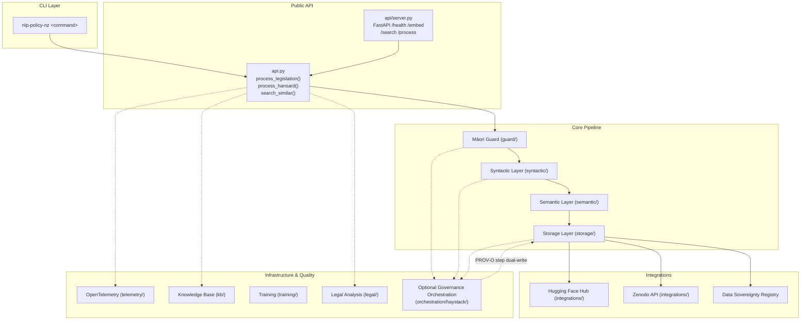
```mermaid
flowchart TB
    subgraph CLI["CLI Layer"]
        CLI_MAIN["nlp-policy-nz &lt;command&gt;"]
    end

    subgraph API["Public API"]
        API_PY["api.py<br/>process_legislation()<br/>process_hansard()<br/>search_similar()"]
        API_SRV["api/server.py<br/>FastAPI /health /embed<br/>/search /process"]
    end

    subgraph CORE["Core Pipeline"]
        GUARD["Māori Guard (guard/)"]
        SYNTACTIC["Syntactic Layer (syntactic/)"]
        SEMANTIC["Semantic Layer (semantic/)"]
        STORAGE["Storage Layer (storage/)"]
    end

    subgraph INT["Integrations"]
        HF["Hugging Face Hub (integrations/)"]
        ZENODO["Zenodo API (integrations/)"]
        REG["Data Sovereignty Registry"]
    end

    subgraph INFRA["Infrastructure & Quality"]
        OTEL["OpenTelemetry (telemetry/)"]
        KB["Knowledge Base (kb/)"]
        TRAIN["Training (training/)"]
        LEGAL["Legal Analysis (legal/)"]
        ORCH["Optional Governance Orchestration<br/>(orchestration/haystack/)"]
    end

    CLI_MAIN --> API_PY
    API_SRV --> API_PY
    API_PY --> GUARD --> SYNTACTIC --> SEMANTIC --> STORAGE
    STORAGE --> HF
    STORAGE --> ZENODO
    STORAGE --> REG
    API_PY -.-> OTEL
    API_PY -.-> KB
    API_PY -.-> LEGAL
    GUARD -.-> ORCH
    SYNTACTIC -.-> ORCH
    STORAGE -.-> ORCH
    ORCH -.->|"PROV-O step dual-write"| STORAGE
```

---

## 2. Module Dependency Graph

```mermaid
flowchart LR
    subgraph Guard["guard/"]
        NORM["normalizer.py"]
        TOK["tokenizer_exceptions.py"]
        LID["language_id.py"]
    end
    subgraph Syntactic["syntactic/"]
        PIPE["pipeline.py"]
        CIT["citations.py"]
        CHUNK["chunking.py"]
    end
    subgraph Semantic["semantic/"]
        ML["model_loader.py"]
        EMB["embeddings.py"]
        FT["finetune.py"]
    end
    subgraph Storage["storage/"]
        SER["serialization.py"]
        VEC["vectordb.py"]
    end
    subgraph CLI_MOD["cli/"]
        MAIN["main.py"]
        GRAPH["graph.py"]
    end
    NORM --> PIPE; TOK --> PIPE; LID --> PIPE
    PIPE --> CIT; PIPE --> CHUNK
    ML --> EMB; EMB --> SER; CHUNK --> SER
    SER --> VEC; CIT --> GRAPH
    MAIN --> PIPE; MAIN --> CIT; MAIN --> GRAPH

    style NORM fill:#90EE90; style TOK fill:#90EE90; style LID fill:#90EE90
    style PIPE fill:#87CEEB; style CIT fill:#87CEEB; style CHUNK fill:#87CEEB
    style ML fill:#DDA0DD; style EMB fill:#DDA0DD; style FT fill:#DDA0DD
    style SER fill:#F0E68C; style VEC fill:#F0E68C
```

---

## 3. Pipeline Data Flow

```mermaid
sequenceDiagram
    participant C as CLI
    participant A as api.py
    participant G as Māori Guard
    participant S as Syntactic
    participant SE as Semantic
    participant ST as Storage

    C->>A: process_legislation(path)
    A->>A: resolve input files
    A->>G: normalize_text(raw)
    G-->>A: clean_text
    A->>S: create_nlp_pipeline()
    S-->>A: nlp pipeline
    A->>S: chunk_legislation_document()
    S-->>A: list[dict] chunks
    loop Every chunk
        A->>G: detect_code_switching(text)
        G-->>A: [(lang, segment)]
        A->>S: process(text, nlp)
        S-->>A: doc with entities
        A->>A: extract citations
        opt If generate_embeddings
            A->>SE: load_model()
            SE-->>A: model, tokenizer
            A->>SE: generate_embedding(text)
            SE-->>A: embedding vector
        end
        A->>A: build PipelineRecord
    end
    A->>ST: serialize_to_parquet(records)
    ST-->>A: output_path
    A-->>C: Parquet path

---

## 4. Legislation Processing Pipeline

```mermaid
flowchart LR
    XML["XML/HTML Input"] --> ING["Universal Ingestion Engine"]
    ING --> GUARD["Māori Guard • Normalizer • Tokenizer"]
    GUARD --> SYN["Syntactic • Pipeline • Citations • Chunking"]
    SYN --> SEM["Semantic • Embeddings (optional)"]
    SEM --> PARQ["Parquet Serialization"]
    PARQ --> LANCE["LanceDB Vector Index"]
    PARQ --> HF("Hugging Face Hub")
    PARQ --> ZEN("Zenodo Archive")
```

---

## 5. Hansard Processing Pipeline

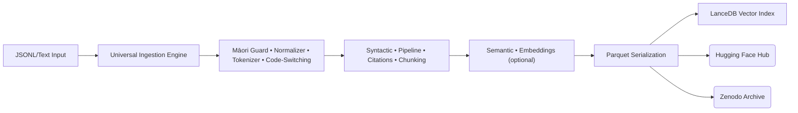
```mermaid
flowchart LR
    JSONL["JSONL/Text Input"] --> ING["Universal Ingestion Engine"]
    ING --> GUARD["Māori Guard • Normalizer • Tokenizer • Code-Switching"]
    GUARD --> SYN["Syntactic • Pipeline • Citations • Chunking"]
    SYN --> SEM["Semantic • Embeddings (optional)"]
    SEM --> PARQ["Parquet Serialization"]
    PARQ --> LANCE["LanceDB Vector Index"]
    PARQ --> HF("Hugging Face Hub")
    PARQ --> ZEN("Zenodo Archive")
```

---

## 6. Track Roadmap (Phase II + III)

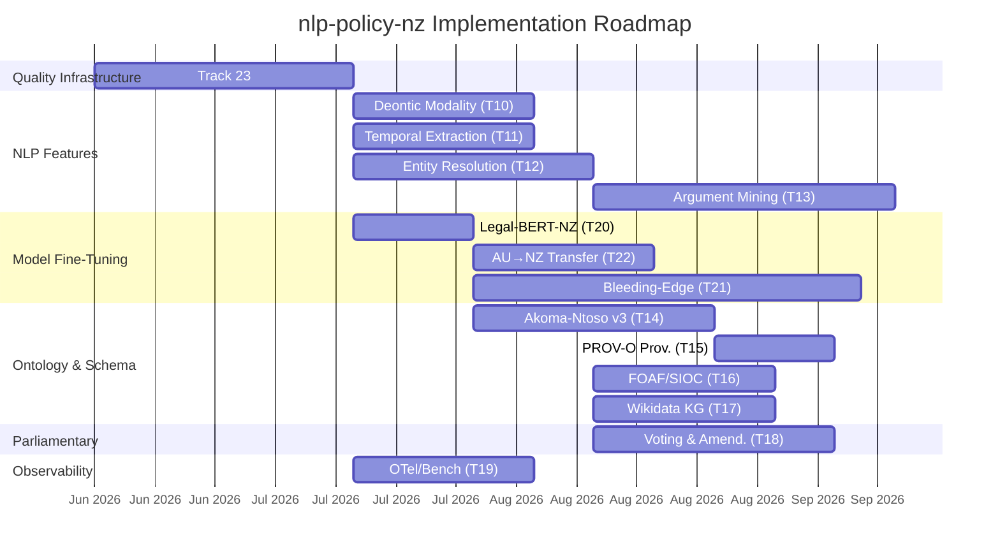
```mermaid
gantt
    title nlp-policy-nz Implementation Roadmap
    dateFormat  YYYY-MM-DD
    axisFormat  %b %Y

    section Quality Infrastructure
    Track 23 :T23, 2026-06-14, 30d

    section NLP Features
    Deontic Modality (T10)     :T10, after T23, 21d
    Temporal Extraction (T11)  :T11, after T23, 21d
    Entity Resolution (T12)    :T12, after T23, 28d
    Argument Mining (T13)      :T13, after T12, 35d

    section Model Fine-Tuning
    Legal-BERT-NZ (T20) :T20, after T23, 14d
    AU→NZ Transfer (T22):T22, after T20, 21d
    Bleeding-Edge (T21) :T21, after T20, 45d

    section Ontology & Schema
    Akoma-Ntoso v3 (T14) :T14, after T20, 28d
    PROV-O Prov. (T15)   :T15, after T14, 14d
    FOAF/SIOC (T16)      :T16, after T12, 21d
    Wikidata KG (T17)    :T17, after T12, 21d

    section Parliamentary
    Voting & Amend. (T18):T18, after T12, 28d

    section Observability
    OTel/Bench (T19) :T19, after T23, 21d
```

---

## 7. Deployment Architecture

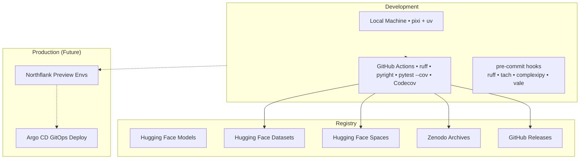
```mermaid
flowchart TB
    subgraph DEV["Development"]
        LOCAL["Local Machine • pixi + uv"]
        CI["GitHub Actions • ruff • pyright • pytest --cov • Codecov"]
        PRE["pre-commit hooks<br/>ruff • tach • complexipy • vale"]
    end
    subgraph REG["Registry"]
        HF_MODEL["Hugging Face Models"]
        HF_DATASET["Hugging Face Datasets"]
        HF_SPACE["Hugging Face Spaces"]
        ZEN["Zenodo Archives"]
        GH["GitHub Releases"]
    end
    subgraph PROD["Production (Future)"]
        NF["Northflank Preview Envs"]
        ARGO["Argo CD GitOps Deploy"]
    end
    DEV --> CI
    CI --> GH; CI --> HF_DATASET; CI --> HF_SPACE; CI --> ZEN
    DEV -.-> NF -.-> ARGO
```

---

## 8. Quality Gates

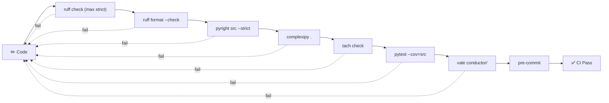
```mermaid
flowchart LR
    A["✏️ Code"] --> B["ruff check (max strict)"]
    B --> C["ruff format --check"]
    C --> D["pyright src --strict"]
    D --> E["complexipy ."]
    E --> F["tach check"]
    F --> G["pytest --cov=src"]
    G --> H["vale conductor/"]
    H --> I["pre-commit"]
    I --> J["✅ CI Pass"]
    B -.->|fail| A; C -.->|fail| A; D -.->|fail| A
    E -.->|fail| A; F -.->|fail| A; G -.->|fail| A; H -.->|fail| A
```

---

## 9. Module Responsibilities

### guard/ — Māori Language Guard
- **normalizer.py**: NFC normalization, macron reduction
- **tokenizer_exceptions.py**: Māori lexical atom protection
- **language_id.py**: mi/en code-switching detection

### syntactic/ — Syntactic Parsing
- **pipeline.py**: spaCy pipeline factory
- **citations.py**: NZ Act/Section EntityRuler patterns
- **chunking.py**: Sentence-level chunking with doc_id

### semantic/ — Embeddings & Fine-Tuning
- **model_loader.py**: Quantized model loading
- **embeddings.py**: Dense embedding generation
- **finetune.py**: MLM domain adaptation

### storage/ — Parquet & Vectors
- **serialization.py**: narwhals + PyArrow Parquet I/O
- **vectordb.py**: LanceDB index management
- **haystack_pipeline.py**: Thin LanceDB-backed retrieval wrapper (Haystack-shaped API without importing `haystack-ai`)

### orchestration/ — Optional Governance Orchestration (Track 99)
- **haystack/decision.py**: Allowed/banned contexts; `haystack_available()`; default-import guard
- **haystack/components.py**: RightsGate, LegalStructureSplitter, SpaCyEnricher, ProvenanceStepRecorder, LanceDBDocumentWriter
- **haystack/pipelines.py**: Offline indexing DAG; rights-gated extractive span QA; generative-forbidden restricted query graph
- **haystack/evaluation.py**: ExactMatch + SAS-proxy scorecards (`promotion_allowed=False`)
- **haystack/types.py**: `GovernanceDocument`, `ExtractedSpanAnswer`
- Docs: `docs/haystack-governance-decision.md`, `docs/haystack-sovereign-deploy.md`

### integrations/ — External APIs
- **huggingface.py**, **hf_uploader.py**, **dataset_card.py**
- **zenodo.py**, **zenodo_archive.py**, **release.py**
- **data_registry.py**: DataSovereigntyRegistry

### cli/ — Command-Line Interface
- **main.py**: argparse (process, search, upload-dataset, deploy-space, archive-to-zenodo, release)
- **graph.py**: NetworkX relational graph

### api/ — FastAPI Inference Server
- **server.py**: /health, /embed, /search, /process

### Planned (Phase II)
- **legal/**: Deontic (T10), Temporal (T11)
- **kb/**: Entity KB (T12), Wikidata (T17)
- **discourse/**: Argument (T13), Stance (T13)
- **provenance/**: PROV-O (T15)
- **linked_data/**: FOAF, SIOC (T16)
- **parliament/**: Voting, Amendments (T18)
- **telemetry/**: OTel spans (T19)
- **training/**: Fine-tuning (T20)
- **schema/**: AKN v3 (T14)

---

## 10. Versioning Strategy

| Version | File | Description |
|---------|------|-------------|
| v1 | `universal_framework_v1.py` | Baseline ingestion + TEI/AKN/ParlaCAP |
| v2 | `universal_framework_v2.py` | Max: TEI sentences, AKN FRBR, dep JSONL |
| v3 | `universal_framework_v3.py` | SpanGroups, displaCy viz |
| v4 | *planned* | AKN v3 full schema (T14) |

---

## 11. Downstream Consumers

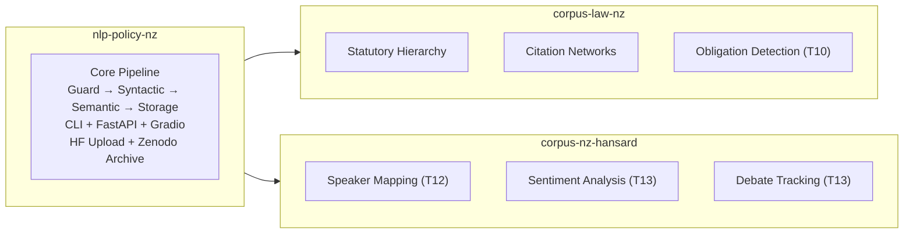
```mermaid
flowchart LR
    subgraph CORE["nlp-policy-nz"]
        PIPE["Core Pipeline<br/>Guard → Syntactic → Semantic → Storage<br/>CLI + FastAPI + Gradio<br/>HF Upload + Zenodo Archive"]
    end
    subgraph LAW["corpus-law-nz"]
        L1["Statutory Hierarchy"]
        L2["Citation Networks"]
        L3["Obligation Detection (T10)"]
    end
    subgraph HANS["corpus-nz-hansard"]
        H1["Speaker Mapping (T12)"]
        H2["Sentiment Analysis (T13)"]
        H3["Debate Tracking (T13)"]
    end
    CORE --> LAW; CORE --> HANS
```

---

## 12. FOI and Historical Archive Integration

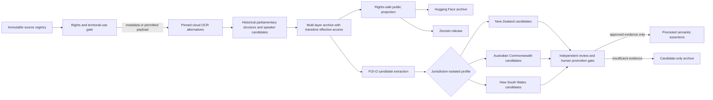
```mermaid
flowchart LR
    REG["Immutable source registry"] --> RIGHTS["Rights and territorial-use gate"]
    RIGHTS -->|"metadata or permitted payload"| OCR["Pinned cloud OCR alternatives"]
    OCR --> PARL["Historical parliamentary structure and speaker candidates"]
    PARL --> ARCH["Multi-layer archive with transitive effective access"]
    ARCH --> PUBLIC["Rights-safe public projection"]
    PUBLIC --> HF["Hugging Face archive"]
    PUBLIC --> ZEN["Zenodo release"]

    ARCH --> FOIO["FOI-O candidate extraction"]
    FOIO --> PROFILE{"Jurisdiction-isolated profile"}
    PROFILE --> NZ["New Zealand candidates"]
    PROFILE --> CTH["Australian Commonwealth candidates"]
    PROFILE --> NSW["New South Wales candidates"]
    NZ --> REVIEW["Independent review and human promotion gate"]
    CTH --> REVIEW
    NSW --> REVIEW
    REVIEW -->|"approved evidence only"| PROMOTED["Promoted semantic assertions"]
    REVIEW -->|"insufficient evidence"| CANDIDATE["Candidate-only archive"]
```

The rights gate is authoritative over descendant defaults. A restricted source
cannot become public because a span, token, speech, assertion, table, or
embedding omits or weakens its local access marker. FOI-O outputs remain
candidate-only until real immutable pins, held-out evaluation, disagreement
adjudication, and jurisdiction-specific promotion evidence are recorded.

---

## 13. Optional Governance Orchestration (Track 99)

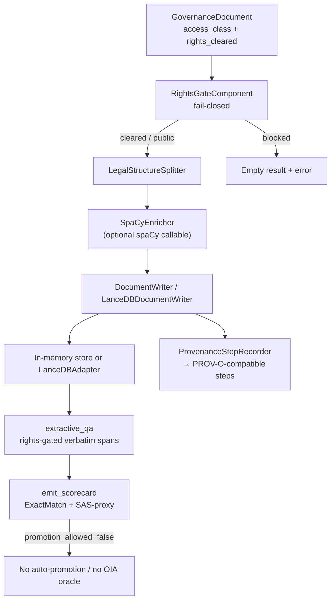
```mermaid
flowchart TB
    RAW["GovernanceDocument<br/>access_class + rights_cleared"] --> GATE["RightsGateComponent<br/>fail-closed"]
    GATE -->|"cleared / public"| SPLIT["LegalStructureSplitter"]
    GATE -->|"blocked"| ERR["Empty result + error"]
    SPLIT --> ENRICH["SpaCyEnricher<br/>(optional spaCy callable)"]
    ENRICH --> WRITE["DocumentWriter / LanceDBDocumentWriter"]
    WRITE --> STORE["In-memory store or LanceDBAdapter"]
    WRITE --> PROV["ProvenanceStepRecorder<br/>→ PROV-O-compatible steps"]

    STORE --> QA["extractive_qa<br/>rights-gated verbatim spans"]
    QA --> SCORE["emit_scorecard<br/>ExactMatch + SAS-proxy"]
    SCORE -->|"promotion_allowed=false"| BOUNDARY["No auto-promotion / no OIA oracle"]
```

**Boundary:** Canonical engines remain spaCy, LanceDB, `PipelineRecord`, and PROV-O.
The `orchestration/haystack/` package is a CI-safe pure-Python shell that mirrors
Haystack component shapes. Real `haystack-ai` installs only via optional extras
`rag` / `orchestration`. Generative cloud defaults and FaithfulnessEvaluator-as-
promotion-oracle are banned.

---

## 14. Phase XV — Adoption, Jurisdiction Profiles & Bleeding-Edge

Programme: Tracks 100–105 / GitHub [#196](https://github.com/edithatogo/nlp-policy-nz/issues/196).

### 14.1 Programme dependency map

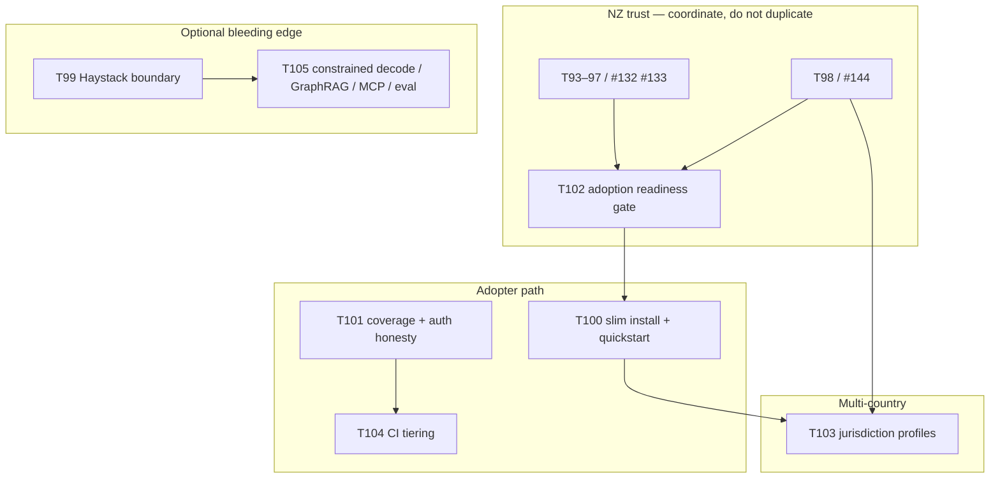
```mermaid
flowchart TB
  subgraph NZ_Evidence["NZ trust — coordinate, do not duplicate"]
    T93["T93–97 / #132 #133"]
    T98["T98 / #144"]
    T102["T102 adoption readiness gate"]
    T93 --> T102
    T98 --> T102
  end
  subgraph Adopt["Adopter path"]
    T100["T100 slim install + quickstart"]
    T101["T101 coverage + auth honesty"]
    T104["T104 CI tiering"]
  end
  subgraph Multi["Multi-country"]
    T103["T103 jurisdiction profiles"]
    T98 --> T103
  end
  subgraph Edge["Optional bleeding edge"]
    T105["T105 constrained decode / GraphRAG / MCP / eval"]
    T99["T99 Haystack boundary"] --> T105
  end
  T100 --> T103
  T102 --> T100
  T101 --> T104
```

### 14.2 Jurisdiction profile runtime

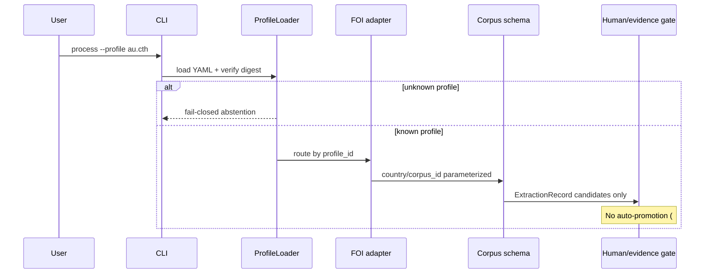
```mermaid
sequenceDiagram
  participant User
  participant CLI
  participant Loader as ProfileLoader
  participant Adapter as FOI adapter
  participant Schema as Corpus schema
  participant Gate as Human/evidence gate
  User->>CLI: process --profile au.cth
  CLI->>Loader: load YAML + verify digest
  alt unknown profile
    Loader-->>CLI: fail-closed abstention
  else known profile
    Loader->>Adapter: route by profile_id
    Adapter->>Schema: country/corpus_id parameterized
    Schema->>Gate: ExtractionRecord candidates only
    Note over Gate: No auto-promotion (#144 / T102)
  end
```

### 14.3 Install and CI layers

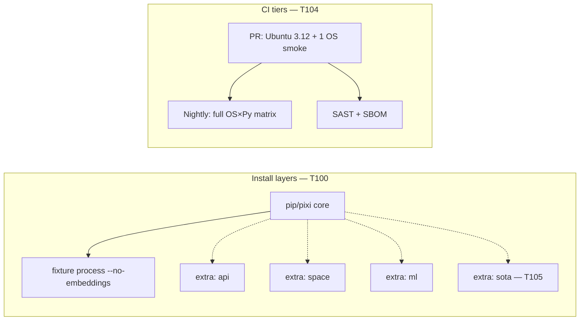
```mermaid
flowchart LR
  subgraph Install["Install layers — T100"]
    CORE["pip/pixi core"] --> FIX["fixture process --no-embeddings"]
    CORE -.-> API["extra: api"]
    CORE -.-> SPACE["extra: space"]
    CORE -.-> ML["extra: ml"]
    CORE -.-> SOTA["extra: sota — T105"]
  end
  subgraph CI["CI tiers — T104"]
    PR["PR: Ubuntu 3.12 + 1 OS smoke"] --> NIGHT["Nightly: full OS×Py matrix"]
    PR --> SEC["SAST + SBOM"]
  end
```
