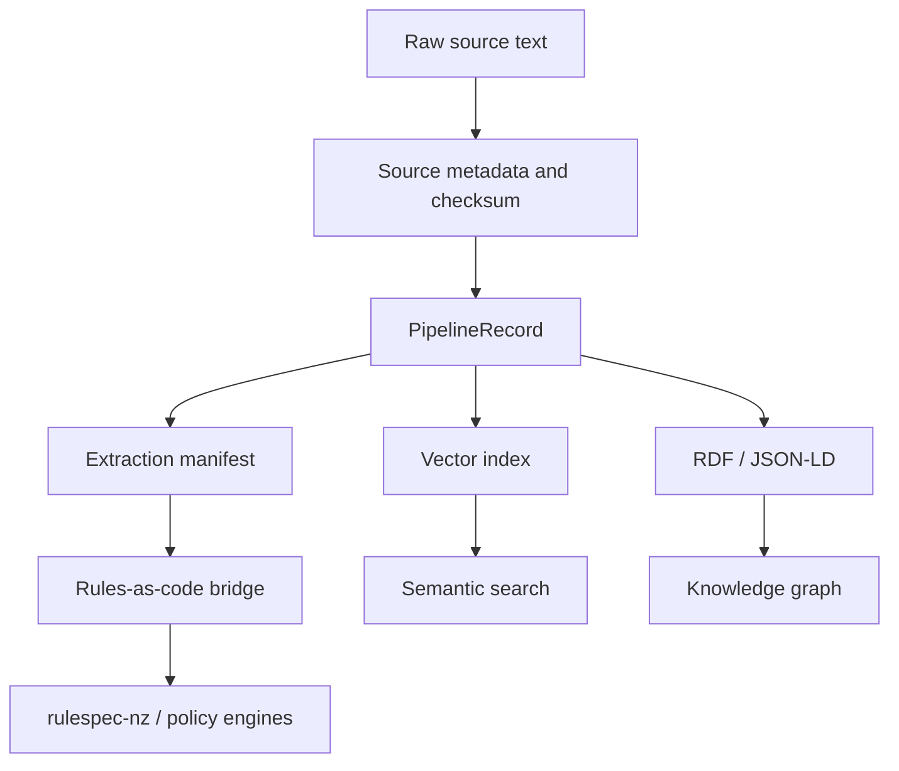

# Data flow

```mermaid
flowchart TD
  raw["Raw source text"] --> source["Source metadata and checksum"]
  source --> records["PipelineRecord"]
  records --> extract["Extraction manifest"]
  records --> vector["Vector index"]
  records --> rdf["RDF / JSON-LD"]
  extract --> rac["Rules-as-code bridge"]
  vector --> search["Semantic search"]
  rdf --> kg["Knowledge graph"]
  rac --> downstream["rulespec-nz / policy engines"]
```

Every publication path should remain reproducible from raw source text,
retrieval metadata, and versioned transformation code.
