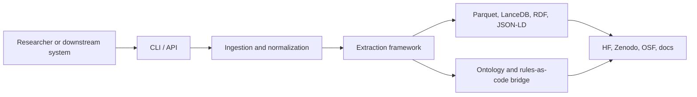

# System overview

Major subsystems:

- CLI and FastAPI entry points.
- Source-grounded ingestion for legislation and Hansard.
- Broad extraction framework for legal, temporal, entity, amendment, and
  rules-as-code outputs.
- Ontology mapping and linked-data export.
- Storage and publication adapters.
- Observability, benchmarking, and CI gates.
